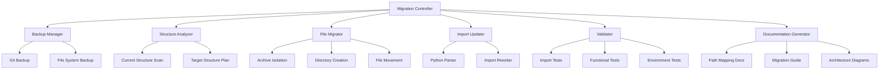

# Design Document

## Overview

This document outlines the design for an automated project restructuring system that will safely reorganize the n8n-local-stack financial sentiment analysis project. The system will migrate from a flat, mixed structure to a logical, hierarchical organization while preserving all functionality and data integrity.

The migration system will be implemented as a Python-based tool with comprehensive validation, rollback capabilities, and environment compatibility testing.

## Architecture

### High-Level Architecture



### Component Responsibilities

1. **Migration Controller**: Orchestrates the entire migration process
2. **Backup Manager**: Creates comprehensive backups for rollback capability
3. **Structure Analyzer**: Analyzes current structure and plans target organization
4. **File Migrator**: Handles physical file and directory operations
5. **Import Updater**: Updates Python import statements to match new structure
6. **Validator**: Runs comprehensive tests to ensure migration success
7. **Documentation Generator**: Updates and creates documentation

## Components and Interfaces

### Migration Controller

```python
class MigrationController:
    def __init__(self, project_root: Path, dry_run: bool = False):
        self.project_root = project_root
        self.dry_run = dry_run
        self.backup_manager = BackupManager(project_root)
        self.structure_analyzer = StructureAnalyzer(project_root)
        self.file_migrator = FileMigrator(project_root, dry_run)
        self.import_updater = ImportUpdater(project_root, dry_run)
        self.validator = Validator(project_root)
        self.doc_generator = DocumentationGenerator(project_root)
    
    def migrate(self) -> MigrationResult:
        """Execute complete migration process"""
        
    def rollback(self) -> RollbackResult:
        """Rollback to pre-migration state"""
        
    def validate(self) -> ValidationResult:
        """Validate current state"""
```

### Structure Analyzer

```python
class StructureAnalyzer:
    def analyze_current_structure(self) -> CurrentStructure:
        """Analyze existing directory structure and file organization"""
        
    def plan_target_structure(self) -> TargetStructure:
        """Generate target directory structure plan"""
        
    def identify_migration_tasks(self) -> List[MigrationTask]:
        """Create list of specific migration tasks"""
```

### File Migrator

```python
class FileMigrator:
    def isolate_archive(self) -> ArchiveResult:
        """Move archive files to top-level archive/ directory"""
        
    def create_directory_structure(self, target: TargetStructure) -> DirectoryResult:
        """Create new directory structure"""
        
    def migrate_files(self, tasks: List[MigrationTask]) -> MigrationResult:
        """Execute file migration tasks"""
        
    def cleanup_empty_directories(self) -> CleanupResult:
        """Remove empty directories after migration"""
```

### Import Updater

```python
class ImportUpdater:
    def scan_python_files(self) -> List[PythonFile]:
        """Find all Python files that need import updates"""
        
    def update_imports(self, files: List[PythonFile]) -> ImportUpdateResult:
        """Update import statements in Python files"""
        
    def create_path_utils(self) -> PathUtilsResult:
        """Create centralized path resolution utility"""
```

### Validator

```python
class Validator:
    def validate_imports(self) -> ImportValidationResult:
        """Test that all critical modules can be imported"""
        
    def validate_functionality(self) -> FunctionalValidationResult:
        """Test end-to-end functionality"""
        
    def validate_environments(self) -> EnvironmentValidationResult:
        """Test Docker and local environment compatibility"""
        
    def run_full_validation(self) -> ValidationResult:
        """Execute complete validation suite"""
```

## Data Models

### Migration Configuration

```python
@dataclass
class MigrationConfig:
    project_root: Path
    dry_run: bool
    backup_enabled: bool
    validation_enabled: bool
    target_structure: TargetStructure
    
@dataclass
class TargetStructure:
    pipelines: PipelineStructure
    dashboards: DashboardStructure
    services: ServiceStructure
    config: ConfigStructure
    utils: UtilsStructure
    tests: TestStructure
    archive: ArchiveStructure
    build: BuildStructure
```

### Migration Tasks

```python
@dataclass
class MigrationTask:
    task_type: TaskType  # MOVE, COPY, CREATE_DIR, UPDATE_IMPORT
    source_path: Optional[Path]
    target_path: Path
    description: str
    dependencies: List[str]
    
@dataclass
class MigrationResult:
    success: bool
    tasks_completed: List[MigrationTask]
    tasks_failed: List[MigrationTask]
    errors: List[str]
    backup_location: Optional[Path]
```

### Validation Results

```python
@dataclass
class ValidationResult:
    overall_success: bool
    import_validation: ImportValidationResult
    functional_validation: FunctionalValidationResult
    environment_validation: EnvironmentValidationResult
    
@dataclass
class ImportValidationResult:
    success: bool
    successful_imports: List[str]
    failed_imports: List[str]
    
@dataclass
class FunctionalValidationResult:
    success: bool
    sentiment_engine_test: bool
    dashboard_generation_test: bool
    pipeline_execution_test: bool
```

## Correctness Properties

*A property is a characteristic or behavior that should hold true across all valid executions of a system-essentially, a formal statement about what the system should do. Properties serve as the bridge between human-readable specifications and machine-verifiable correctness guarantees.*

After analyzing the acceptance criteria, I've identified the following testable properties that must hold for the migration system:

### Property Reflection

Reviewing the prework analysis, I identified several areas where properties can be consolidated:
- Properties 1.1, 1.3, and 1.4 all relate to file preservation and can be combined into a comprehensive file integrity property
- Properties 2.1-2.6 all relate to directory structure creation and can be combined into a structure organization property  
- Properties 3.1, 3.2, and 3.3 all relate to import updating and can be combined into an import consistency property
- Properties 4.1-4.5 all relate to functional preservation and can be combined into a functionality preservation property

### Core Properties

**Property 1: File Migration Integrity**
*For any* file in the original project structure, after migration the file should exist in exactly one location in the new structure, and the total number of files should be preserved
**Validates: Requirements 1.1, 1.3, 1.4, 2.1, 2.2, 2.3, 2.4, 2.5, 2.6**

**Property 2: Import Path Consistency**
*For any* Python file in the migrated structure, all import statements should resolve successfully and reference modules in their new locations
**Validates: Requirements 3.1, 3.2, 3.3, 3.4, 3.5**

**Property 3: Functional Preservation**
*For any* critical system function (sentiment analysis, dashboard generation, pipeline execution), the function should produce equivalent results before and after migration
**Validates: Requirements 4.1, 4.2, 4.3, 4.4, 4.5**

**Property 4: Environment Compatibility**
*For any* supported environment (Docker, local Windows), all system functions should work correctly after migration
**Validates: Requirements 8.1, 8.2, 8.3, 8.4, 8.5**

**Property 5: Rollback Completeness**
*For any* migration followed by rollback, the system should return to a functionally equivalent state as the original
**Validates: Requirements 6.1, 6.2, 6.3, 6.4, 6.5**

**Property 6: Validation Coverage**
*For any* validation test in the suite, it should provide meaningful verification of system integrity and catch potential issues
**Validates: Requirements 5.1, 5.2, 5.3, 5.4, 5.5, 5.6**

**Property 7: Documentation Accuracy**
*For any* path reference in generated documentation, it should correctly point to the actual location of files in the new structure
**Validates: Requirements 7.1, 7.2, 7.3, 7.4, 7.5**

## Error Handling

### Migration Errors

The system will handle various error conditions:

1. **File System Errors**: Permission issues, disk space, locked files
2. **Import Errors**: Circular dependencies, missing modules, syntax errors
3. **Validation Errors**: Failed tests, broken functionality, environment issues
4. **Rollback Errors**: Backup corruption, partial rollback, state inconsistency

### Error Recovery Strategy

```python
class ErrorHandler:
    def handle_migration_error(self, error: MigrationError) -> ErrorResponse:
        """Handle errors during migration with appropriate recovery"""
        
    def handle_validation_error(self, error: ValidationError) -> ErrorResponse:
        """Handle validation failures with detailed reporting"""
        
    def handle_rollback_error(self, error: RollbackError) -> ErrorResponse:
        """Handle rollback failures with manual recovery guidance"""
```

### Logging and Monitoring

All operations will be logged with appropriate detail levels:
- **INFO**: Major phase transitions, successful operations
- **WARNING**: Non-critical issues, fallback actions
- **ERROR**: Critical failures, rollback triggers
- **DEBUG**: Detailed operation traces for troubleshooting

## Testing Strategy

### Dual Testing Approach

The migration system will use both unit tests and property-based tests:

**Unit Tests**: Verify specific examples, edge cases, and error conditions
- Test individual component functionality
- Test specific migration scenarios
- Test error handling paths
- Test rollback mechanisms

**Property Tests**: Verify universal properties across all inputs
- Test file integrity preservation across different project structures
- Test import consistency across various Python codebases
- Test functional preservation across different system configurations
- Test environment compatibility across different setups

### Property-Based Testing Configuration

- **Framework**: Hypothesis (Python property-based testing library)
- **Minimum iterations**: 100 per property test
- **Test tagging**: Each property test will reference its design document property
- **Tag format**: **Feature: project-restructuring, Property {number}: {property_text}**

### Test Organization

```
tests/
├── unit/
│   ├── test_migration_controller.py
│   ├── test_file_migrator.py
│   ├── test_import_updater.py
│   └── test_validator.py
├── integration/
│   ├── test_full_migration.py
│   ├── test_rollback.py
│   └── test_environment_compatibility.py
├── property/
│   ├── test_file_integrity_property.py
│   ├── test_import_consistency_property.py
│   ├── test_functional_preservation_property.py
│   └── test_rollback_completeness_property.py
└── fixtures/
    ├── sample_project_structures/
    ├── test_configurations/
    └── mock_environments/
```

### Validation Test Suite

The system will include a comprehensive validation suite that:
1. Tests all critical module imports
2. Validates sentiment engine functionality with sample data
3. Confirms dashboard generation produces valid output
4. Verifies pipeline execution in both environments
5. Checks configuration file accessibility
6. Validates path resolution in Docker and local environments

Each validation test will run with a minimum of 100 iterations to ensure reliability through property-based testing, and will be tagged with references to the corresponding design properties for traceability.