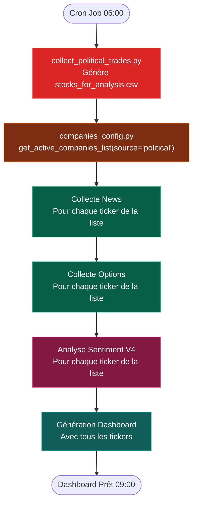

# 🔗 Guide d'Intégration: Political Trades → Analyse Sentiment

## 📋 Vue d'Ensemble

Le fichier `stocks_for_analysis.csv` généré par `collect_political_trades.py` peut maintenant être utilisé comme source pour alimenter automatiquement votre processus d'analyse sentiment.

---

## 🎯 Modes d'Utilisation

### Mode 1: Liste Manuelle (Défaut)

Utilise la liste codée en dur dans `companies_config.py` (15 compagnies AI)

```python
from prod.config.companies_config import get_active_companies_list

companies = get_active_companies_list(source='manual')
# Retourne: NVDA, MSFT, GOOGL, META, etc. (15 stocks AI)
```

### Mode 2: Political Trades (Tous)

Utilise **tous** les stocks avec activité politique (min 5 trades)

```python
companies = get_active_companies_list(source='political')
# Retourne: Tous les stocks du fichier stocks_for_analysis.csv
```

### Mode 3: Political Trades (Bullish Only)

Utilise **seulement** les stocks avec signal BULLISH

```python
companies = get_active_companies_list(source='political_bullish')
# Retourne: Stocks avec sentiment_score > 0.3
```

### Mode 4: Political Trades (Bearish Only)

Utilise **seulement** les stocks avec signal BEARISH

```python
companies = get_active_companies_list(source='political_bearish')
# Retourne: Stocks avec sentiment_score < -0.3
```

---

## 🔧 Intégration dans daily_automation.py

### Modification Proposée

```python
# Dans prod/automation/daily_automation.py

def run_daily_automation():
    """
    Automation quotidienne complète
    """
    
    # 1. Collecter political trades
    log("💰 ÉTAPE 1: Collecte Political Trades")
    success = run_command(
        ['python3', '/data/scripts/collect_political_trades.py'],
        "Collecte Political Trades",
        timeout=600
    )
    
    if not success:
        log("⚠️ Collecte political trades échouée - continue avec liste manuelle")
    
    # 2. Déterminer la liste de stocks à analyser
    log("📊 ÉTAPE 2: Sélection des stocks")
    
    # Option A: Utiliser liste manuelle
    # MODE = 'manual'
    
    # Option B: Utiliser tous les stocks political (RECOMMANDÉ)
    MODE = 'political'
    
    # Option C: Seulement les bullish
    # MODE = 'political_bullish'
    
    # Option D: Seulement les bearish
    # MODE = 'political_bearish'
    
    from prod.config.companies_config import get_active_companies_list
    companies = get_active_companies_list(source=MODE)
    
    log(f"   ✅ {len(companies)} compagnies sélectionnées (mode: {MODE})")
    
    # 3. Collecter news pour ces stocks
    log("📰 ÉTAPE 3: Collecte News")
    for company in companies:
        ticker = company['ticker']
        # ... collect news for ticker
    
    # 4. Collecter options
    log("💹 ÉTAPE 4: Collecte Options")
    for company in companies:
        ticker = company['ticker']
        # ... collect options for ticker
    
    # 5. Analyse sentiment V4
    log("🧠 ÉTAPE 5: Analyse Sentiment V4")
    for company in companies:
        ticker = company['ticker']
        # ... analyze sentiment for ticker
    
    # 6. Génération dashboard
    log("📊 ÉTAPE 6: Génération Dashboard")
    # ... generate dashboard
```

---

## 📊 Exemples d'Utilisation

### Exemple 1: Analyser seulement les stocks avec forte activité politique

```python
from prod.config.companies_config import get_political_trades_stocks

# Charger les stocks avec minimum 10 trades
stocks = get_political_trades_stocks(min_trades=10)

for stock in stocks:
    ticker = stock['ticker']
    trade_count = stock['trade_count']
    sentiment = stock['sentiment_score']
    signal = stock['signal']
    
    print(f"{ticker}: {trade_count} trades, sentiment={sentiment:.2f}, {signal}")
```

**Output:**
```
NVDA: 45 trades, sentiment=0.67, BULLISH
AAPL: 38 trades, sentiment=-0.15, NEUTRAL
TSLA: 32 trades, sentiment=-0.55, BEARISH
...
```

### Exemple 2: Analyser seulement les bullish avec beaucoup d'activité

```python
# Charger bullish avec min 15 trades
stocks = get_political_trades_stocks(
    min_trades=15,
    sentiment_filter='BULLISH'
)

print(f"✅ {len(stocks)} stocks bullish à analyser")

# Lancer analyse sentiment sur ces stocks
for stock in stocks:
    ticker = stock['ticker']
    # ... run sentiment analysis
```

### Exemple 3: Comparer liste manuelle vs political

```python
from prod.config.companies_config import AI_COMPANIES, get_companies_from_political_trades

manual_list = AI_COMPANIES
political_list = get_companies_from_political_trades(mode='all')

print(f"Liste manuelle: {len(manual_list)} stocks")
print(f"Liste political: {len(political_list)} stocks")

# Trouver les nouveaux stocks (pas dans liste manuelle)
manual_tickers = {c['ticker'] for c in manual_list}
political_tickers = {c['ticker'] for c in political_list}

new_stocks = political_tickers - manual_tickers
print(f"\n🆕 Nouveaux stocks détectés: {new_stocks}")
```

---

## 🔄 Flux Complet Automatisé



---

## ⚙️ Configuration Avancée

### Personnaliser le seuil minimum de trades

```python
# Dans companies_config.py

# Par défaut: minimum 5 trades
stocks = get_political_trades_stocks(min_trades=5)

# Plus sélectif: minimum 10 trades
stocks = get_political_trades_stocks(min_trades=10)

# Très sélectif: minimum 20 trades
stocks = get_political_trades_stocks(min_trades=20)
```

### Combiner liste manuelle + political

```python
from prod.config.companies_config import AI_COMPANIES, get_political_trades_stocks

# Liste manuelle (AI stocks)
manual = AI_COMPANIES

# Liste political trades
political = get_political_trades_stocks(min_trades=10)

# Combiner: union des deux listes
all_tickers = set([c['ticker'] for c in manual])
all_tickers.update([s['ticker'] for s in political])

print(f"Total: {len(all_tickers)} stocks uniques")
```

### Enrichir la liste manuelle avec données political

```python
from prod.config.companies_config import get_companies_from_political_trades

# Cette fonction fait automatiquement:
# 1. Charge les stocks political trades
# 2. Pour chaque stock, cherche s'il existe dans AI_COMPANIES
# 3. Si oui: enrichit avec political_trades, political_sentiment, political_signal
# 4. Si non: crée une nouvelle entrée

companies = get_companies_from_political_trades(mode='all')

for company in companies:
    ticker = company['ticker']
    name = company['name']
    
    # Ces champs sont automatiquement ajoutés
    pol_trades = company.get('political_trades', 0)
    pol_sentiment = company.get('political_sentiment', 0)
    pol_signal = company.get('political_signal', 'NEUTRAL')
    
    print(f"{ticker}: {name} | {pol_trades} trades | {pol_signal}")
```

---

## 🧪 Tests

### Test 1: Vérifier le fichier existe

```python
import os

if os.path.exists('/data'):
    political_file = '/data/political_trades/stocks_for_analysis.csv'
else:
    political_file = 'c:/n8n-local-stack/local_files/political_trades/stocks_for_analysis.csv'

if os.path.exists(political_file):
    print(f"✅ Fichier trouvé: {political_file}")
else:
    print(f"❌ Fichier non trouvé: {political_file}")
    print("   Exécutez: python prod/collection/collect_political_trades.py")
```

### Test 2: Charger et afficher

```python
from prod.config.companies_config import get_political_trades_stocks

stocks = get_political_trades_stocks(min_trades=5)

if stocks:
    print(f"✅ {len(stocks)} stocks chargés")
    print("\nTop 10:")
    for stock in stocks[:10]:
        print(f"  {stock['ticker']:6s} - {stock['trade_count']:3d} trades - {stock['signal']}")
else:
    print("❌ Aucun stock chargé")
```

### Test 3: Mode d'intégration

```python
from prod.config.companies_config import get_active_companies_list

# Test chaque mode
for mode in ['manual', 'political', 'political_bullish', 'political_bearish']:
    companies = get_active_companies_list(source=mode)
    print(f"{mode:20s}: {len(companies):3d} stocks")
```

**Output attendu:**
```
manual              :  15 stocks  (liste codée en dur)
political           :  87 stocks  (tous avec min 5 trades)
political_bullish   :  34 stocks  (seulement bullish)
political_bearish   :  18 stocks  (seulement bearish)
```

---

## 📝 Recommandations

### ✅ Utilisation Recommandée

**Mode: `political`** (tous les stocks avec activité politique)

**Pourquoi:**
- Capture les opportunités émergentes
- Pas biaisé vers bullish ou bearish uniquement
- Découverte automatique de nouveaux stocks
- Liste dynamique qui évolue avec le marché

### ⚠️ Attention

**Ne pas utiliser** `political_bearish` seul pour analyse
- Les politiciens peuvent se tromper
- Signal bearish peut être contrarian (opportunité)
- Mieux: analyser TOUS et laisser le sentiment V4 décider

### 🎯 Workflow Optimal

1. **Daily 06:00**: Collecter political trades
2. **Daily 06:30**: Charger liste avec `source='political'`
3. **Daily 07:00**: Collecter news + options pour cette liste
4. **Daily 08:00**: Analyser sentiment V4 (intègre political + news + options)
5. **Daily 09:00**: Dashboard prêt avec score combiné

---

## 🐛 Dépannage

### Problème: `get_political_trades_stocks()` retourne liste vide

**Solution:**
```bash
# Vérifier le fichier
ls -la /data/political_trades/stocks_for_analysis.csv

# Relancer la collecte
python3 /data/scripts/collect_political_trades.py
```

### Problème: Certains tickers n'ont pas de nom

**Solution:**
Les stocks non présents dans `AI_COMPANIES` auront un nom générique.
Vous pouvez les ajouter manuellement dans `companies_config.py`:

```python
AI_COMPANIES.append({
    "ticker": "NEW_TICKER",
    "name": "New Company Name",
    "search_terms": ["NEW_TICKER", "New Company"],
    "sector": "Technology"
})
```

### Problème: Trop de stocks à analyser

**Solution:**
Augmenter le seuil minimum:

```python
# Au lieu de min_trades=5
companies = get_companies_from_political_trades(
    mode='all',
    min_trades=15  # Plus sélectif
)
```

---

**Créé:** 2 Janvier 2026  
**Version:** 1.0  
**Integration:** Political Trades → Sentiment Analysis Pipeline
