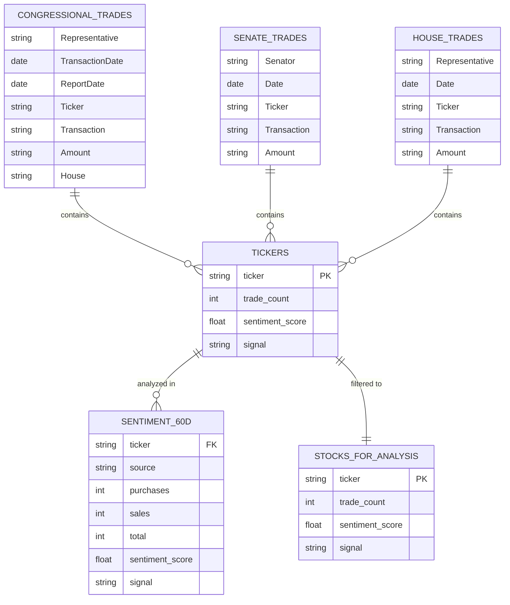

```mermaid
flowchart TB
    %% Styles
    classDef apiClass fill:#1e3a8a,stroke:#3b82f6,stroke-width:2px,color:#fff
    classDef collectorClass fill:#065f46,stroke:#10b981,stroke-width:2px,color:#fff
    classDef dataClass fill:#7c2d12,stroke:#f97316,stroke-width:2px,color:#fff
    classDef cacheClass fill:#4c1d95,stroke:#a78bfa,stroke-width:2px,color:#fff
    classDef analysisClass fill:#831843,stroke:#ec4899,stroke-width:2px,color:#fff
    classDef outputClass fill:#115e59,stroke:#14b8a6,stroke-width:2px,color:#fff
    classDef integrationClass fill:#713f12,stroke:#fbbf24,stroke-width:2px,color:#fff

    %% Source de données
    QQ[("🌐 QuiverQuant API<br/>bibep token")]:::apiClass
    
    %% Script principal
    SCRIPT["📊 collect_political_trades.py<br/>PoliticalTradesCollector"]:::collectorClass
    
    %% Collecte des données
    subgraph COLLECTION["🔄 ÉTAPE 1: Collecte"]
        C1["Congressional Trading<br/>congress_trading()"]:::collectorClass
        C2["Senate Trading<br/>senate_trading()"]:::collectorClass
        C3["House Trading<br/>house_trading()"]:::collectorClass
    end
    
    %% Données brutes
    subgraph RAW_DATA["📁 ÉTAPE 2: Sauvegarde Brute"]
        D1["congressional_trades_TIMESTAMP.csv"]:::dataClass
        D2["senate_trades_TIMESTAMP.csv"]:::dataClass
        D3["house_trades_TIMESTAMP.csv"]:::dataClass
        D4["congressional_trades_latest.csv"]:::dataClass
        D5["senate_trades_latest.csv"]:::dataClass
        D6["house_trades_latest.csv"]:::dataClass
    end
    
    %% Cache historique
    subgraph CACHE["💾 ÉTAPE 3: Cache Historique"]
        CA1["congressional_cache.parquet<br/>Accumulation progressive"]:::cacheClass
        CA2["senate_cache.parquet<br/>Déduplication automatique"]:::cacheClass
        CA3["house_cache.parquet<br/>Résout limite 1000 résultats"]:::cacheClass
    end
    
    %% Analyse des stocks
    subgraph STOCK_ANALYSIS["📊 ÉTAPE 4: Analyse Stocks"]
        SA1["Comptage par Ticker<br/>Counter(all_tickers)"]:::analysisClass
        SA2["DataFrame Tickers<br/>ticker + trade_count"]:::analysisClass
        SA3["TOP 20 Affichage<br/>Console output"]:::analysisClass
    end
    
    %% Analyse sentiment
    subgraph SENTIMENT_ANALYSIS["📈 ÉTAPE 5: Sentiment 60j"]
        SE1["Filtrage 60 jours<br/>cutoff_date = now - 60d"]:::analysisClass
        SE2["Ratio Achats/Ventes<br/>Par ticker + par source"]:::analysisClass
        SE3["Score Sentiment<br/>-1 (bearish) à +1 (bullish)"]:::analysisClass
        SE4["Classification<br/>BULLISH/NEUTRAL/BEARISH"]:::analysisClass
    end
    
    %% Génération finale
    subgraph GENERATION["🎯 ÉTAPE 6: Génération Finale"]
        G1["Merge Tickers + Sentiment<br/>min_trades = 5"]:::analysisClass
        G2["Tri par trade_count<br/>desc"]:::analysisClass
    end
    
    %% Fichiers de sortie
    subgraph OUTPUT["📤 ÉTAPE 7: Fichiers Finaux"]
        O1["stocks_for_analysis.csv<br/>🎯 FICHIER PRINCIPAL"]:::outputClass
        O2["stocks_for_analysis.json<br/>Format API"]:::outputClass
        O3["collection_summary.json<br/>Rapport détaillé"]:::outputClass
    end
    
    %% Intégration future
    subgraph INTEGRATION["🔗 ÉTAPE 8: Intégration (Future)"]
        I1["daily_automation.py<br/>Collecte automatique"]:::integrationClass
        I2["companies_config.py<br/>Lecture stocks_for_analysis"]:::integrationClass
        I3["Analyse Sentiment V4<br/>Sur liste filtrée"]:::integrationClass
        I4["Dashboard Political Trades<br/>Streamlit standalone"]:::integrationClass
        I5["Dashboard V4 HTML<br/>Nouveau niveau navigation"]:::integrationClass
    end
    
    %% Flux principal
    QQ -->|"API Calls<br/>Max 1000 results"| SCRIPT
    SCRIPT -->|"collect_all_trades()"| COLLECTION
    
    COLLECTION -->|"DataFrame"| C1
    COLLECTION -->|"DataFrame"| C2
    COLLECTION -->|"DataFrame"| C3
    
    C1 & C2 & C3 -->|"save_raw_data()"| RAW_DATA
    
    RAW_DATA --> D1 & D2 & D3 & D4 & D5 & D6
    
    D1 & D2 & D3 -->|"cache_with_history()"| CACHE
    
    CACHE --> CA1 & CA2 & CA3
    
    C1 & C2 & C3 -->|"analyze_stocks()"| STOCK_ANALYSIS
    
    STOCK_ANALYSIS --> SA1
    SA1 --> SA2
    SA2 --> SA3
    
    C1 & C2 & C3 -->|"analyze_sentiment_60days()"| SENTIMENT_ANALYSIS
    
    SENTIMENT_ANALYSIS --> SE1
    SE1 --> SE2
    SE2 --> SE3
    SE3 --> SE4
    
    SA2 & SE4 -->|"generate_stock_list_for_analysis()"| GENERATION
    
    GENERATION --> G1
    G1 --> G2
    
    G2 --> OUTPUT
    
    OUTPUT --> O1 & O2 & O3
    
    O1 -.->|"Utilisation future"| INTEGRATION
    
    INTEGRATION --> I1 & I2 & I3 & I4 & I5
    
    %% Notes
    NOTE1[["💡 CACHE SMART:<br/>Accumule données à chaque run<br/>Après 1 an = 365K trades"]]:::cacheClass
    NOTE2[["🎯 OUTPUT PRINCIPAL:<br/>stocks_for_analysis.csv<br/>Liste prête pour analyse"]]:::outputClass
    NOTE3[["⏰ DÉLAI API:<br/>Trades reportés 5-45j après<br/>Sentiment = indicateur anticipé"]]:::apiClass
    
    CACHE -.-> NOTE1
    OUTPUT -.-> NOTE2
    QQ -.-> NOTE3
```

## Flux Détaillé par Fonction

```mermaid
flowchart LR
    %% Styles
    classDef funcClass fill:#1e40af,stroke:#3b82f6,stroke-width:2px,color:#fff
    classDef dataClass fill:#b91c1c,stroke:#ef4444,stroke-width:2px,color:#fff
    classDef processClass fill:#15803d,stroke:#22c55e,stroke-width:2px,color:#fff

    subgraph MAIN["run() - Fonction Principale"]
        direction TB
        F1["1. collect_all_trades()"]:::funcClass
        F2["2. save_raw_data()"]:::funcClass
        F3["3. cache_with_history()"]:::funcClass
        F4["4. analyze_stocks()"]:::funcClass
        F5["5. analyze_sentiment_60days()"]:::funcClass
        F6["6. generate_stock_list_for_analysis()"]:::funcClass
        F7["7. generate_summary_report()"]:::funcClass
        
        F1 --> F2 --> F3 --> F4 --> F5 --> F6 --> F7
    end
    
    subgraph DATA_FLOW["Flux de Données"]
        direction TB
        D1["results: Dict[DataFrame]"]:::dataClass
        D2["df_tickers: DataFrame"]:::dataClass
        D3["df_sentiment: DataFrame"]:::dataClass
        D4["df_sentiment_agg: DataFrame"]:::dataClass
        D5["df_stocks: DataFrame"]:::dataClass
        D6["report: Dict"]:::dataClass
        
        D1 --> D2 --> D5
        D1 --> D3 --> D4 --> D5
        D5 --> D6
    end
    
    F1 -.->|"Retourne"| D1
    F4 -.->|"Retourne"| D2
    F5 -.->|"Retourne"| D3
    F5 -.->|"Retourne"| D4
    F6 -.->|"Retourne"| D5
    F7 -.->|"Retourne"| D6
```

## Structure des Données

## Pipeline d'Intégration (Future)

```mermaid
flowchart TB
    %% Styles
    classDef dailyClass fill:#1e3a8a,stroke:#3b82f6,stroke-width:3px,color:#fff
    classDef existingClass fill:#065f46,stroke:#10b981,stroke-width:2px,color:#fff
    classDef newClass fill:#7c2d12,stroke:#f97316,stroke-width:2px,color:#fff
    classDef dashClass fill:#4c1d95,stroke:#a78bfa,stroke-width:2px,color:#fff

    CRON["⏰ Cron Job Daily<br/>06:00 AM"]:::dailyClass
    
    subgraph AUTOMATION["daily_automation.py"]
        direction TB
        A1["collect_news()<br/>Existant"]:::existingClass
        A2["collect_options()<br/>Existant"]:::existingClass
        A3["collect_political_trades()<br/>🆕 NOUVEAU"]:::newClass
        A4["analyze_sentiment_v4()<br/>Existant"]:::existingClass
        A5["analyze_political_sentiment()<br/>🆕 FUTUR"]:::newClass
        A6["generate_dashboard()<br/>Existant"]:::existingClass
        
        A1 --> A2 --> A3 --> A4 --> A5 --> A6
    end
    
    CRON --> AUTOMATION
    
    subgraph DATA_SOURCES["Sources de Données"]
        DS1["/data/files/companies/<br/>*_news.json"]:::existingClass
        DS2["/data/options_data/<br/>*_calls.csv + *_puts.csv"]:::existingClass
        DS3["/data/political_trades/<br/>stocks_for_analysis.csv"]:::newClass
    end
    
    A1 --> DS1
    A2 --> DS2
    A3 --> DS3
    
    subgraph DASHBOARDS["Dashboards"]
        direction LR
        DASH1["dashboard_v4_split.html<br/>Vue principale"]:::dashClass
        DASH2["dashboard_options.py<br/>Streamlit Options"]:::dashClass
        DASH3["dashboard_political_trades.py<br/>🆕 Streamlit Political"]:::newClass
    end
    
    A6 --> DASH1
    DS2 -.-> DASH2
    DS3 -.-> DASH3
    
    subgraph SUPER_SCORE["🎯 Super Score Combiné"]
        direction TB
        SS["FINAL_SCORE =<br/>news × 0.25 +<br/>options × 0.35 +<br/>political × 0.25 +<br/>analyst × 0.15"]:::newClass
    end
    
    DS1 & DS2 & DS3 --> SUPER_SCORE
    SUPER_SCORE --> DASH1
```

## Timeline d'Exécution Quotidienne

```mermaid
gantt
    title 📅 Automation Quotidienne avec Political Trades
    dateFormat HH:mm
    axisFormat %H:%M
    
    section Collection
    Collect News           :done, news, 06:00, 30m
    Collect Options        :done, opts, 06:30, 30m
    Collect Political Trades :crit, new, 07:00, 30m
    
    section Analyse
    Analyze Sentiment V4   :done, sent, 07:30, 30m
    Analyze Political Sentiment :crit, polsent, 08:00, 30m
    
    section Generation
    Generate Dashboard     :done, dash, 08:30, 30m
    
    section Ready
    Dashboard Available    :milestone, ready, 09:00, 0m
```

## Architecture Fichiers

```mermaid
graph TD
    %% Styles
    classDef dirClass fill:#1e3a8a,stroke:#3b82f6,stroke-width:2px,color:#fff
    classDef fileClass fill:#065f46,stroke:#10b981,stroke-width:1px,color:#fff
    classDef newClass fill:#dc2626,stroke:#f87171,stroke-width:2px,color:#fff

    ROOT["📁 c:\n8n-local-stack"]:::dirClass
    
    ROOT --> PROD["📁 prod/"]:::dirClass
    ROOT --> DATA["📁 local_files/"]:::dirClass
    ROOT --> SERVICES["📁 services/"]:::dirClass
    
    PROD --> COLLECTION["📁 collection/"]:::dirClass
    PROD --> ANALYSIS["📁 analysis/"]:::dirClass
    PROD --> DASHBOARD["📁 dashboard/"]:::dirClass
    
    COLLECTION --> COL1["collect_options.py"]:::fileClass
    COLLECTION --> COL2["collect_political_trades.py"]:::newClass
    COLLECTION --> COL3["README_POLITICAL_TRADES.md"]:::newClass
    
    DATA --> POL_DIR["📁 political_trades/"]:::newClass
    POL_DIR --> POL1["stocks_for_analysis.csv"]:::newClass
    POL_DIR --> POL2["stocks_for_analysis.json"]:::newClass
    POL_DIR --> POL3["collection_summary.json"]:::newClass
    POL_DIR --> POL4["*_trades_latest.csv"]:::newClass
    POL_DIR --> CACHE_DIR["📁 cache/"]:::newClass
    CACHE_DIR --> CACHE1["*.parquet"]:::newClass
    
    SERVICES --> QQ_DIR["📁 quiverquant/"]:::dirClass
    QQ_DIR --> QQ1["quiverquant_client.py"]:::fileClass
    QQ_DIR --> QQ2["config.py"]:::fileClass
```

## Décisions et Traitements

```mermaid
flowchart TD
    %% Styles
    classDef decisionClass fill:#dc2626,stroke:#f87171,stroke-width:2px,color:#fff
    classDef processClass fill:#059669,stroke:#10b981,stroke-width:2px,color:#fff
    classDef outputClass fill:#7c3aed,stroke:#a78bfa,stroke-width:2px,color:#fff

    START([Démarrage Collecte])
    
    D1{Cache existe?}:::decisionClass
    P1[Charger cache existant]:::processClass
    P2[Créer nouveau cache]:::processClass
    
    D2{Colonnes disponibles<br/>pour dédup?}:::decisionClass
    P3[Déduplication sur<br/>Rep + Date + Ticker]:::processClass
    P4[Déduplication générale]:::processClass
    
    P5[Merger new + old]:::processClass
    P6[Sauvegarder cache]:::outputClass
    
    D3{Sentiment score?}:::decisionClass
    P7[Score > 0.3<br/>BULLISH]:::processClass
    P8[-0.3 ≤ Score ≤ 0.3<br/>NEUTRAL]:::processClass
    P9[Score < -0.3<br/>BEARISH]:::processClass
    
    D4{Trade count ≥<br/>min_trades?}:::decisionClass
    P10[Inclure dans liste finale]:::processClass
    P11[Exclure de l'analyse]:::processClass
    
    END([Fin - Fichiers générés])
    
    START --> D1
    D1 -->|Oui| P1
    D1 -->|Non| P2
    
    P1 & P2 --> D2
    D2 -->|Oui| P3
    D2 -->|Non| P4
    
    P3 & P4 --> P5
    P5 --> P6
    
    P6 --> D3
    D3 -->|"> 0.3"| P7
    D3 -->|"-0.3 à 0.3"| P8
    D3 -->|"< -0.3"| P9
    
    P7 & P8 & P9 --> D4
    D4 -->|Oui| P10
    D4 -->|Non| P11
    
    P10 --> END
    P11 --> END
```

---

**Créé:** 2 Janvier 2026  
**Version:** 1.0  
**Documentation:** Flux complet du système Political Trades
