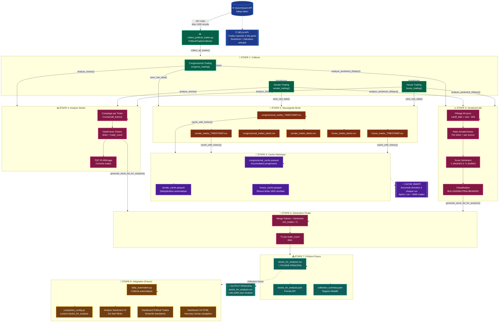
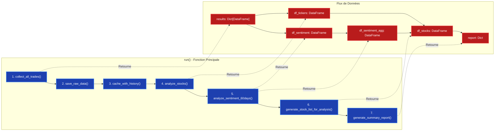
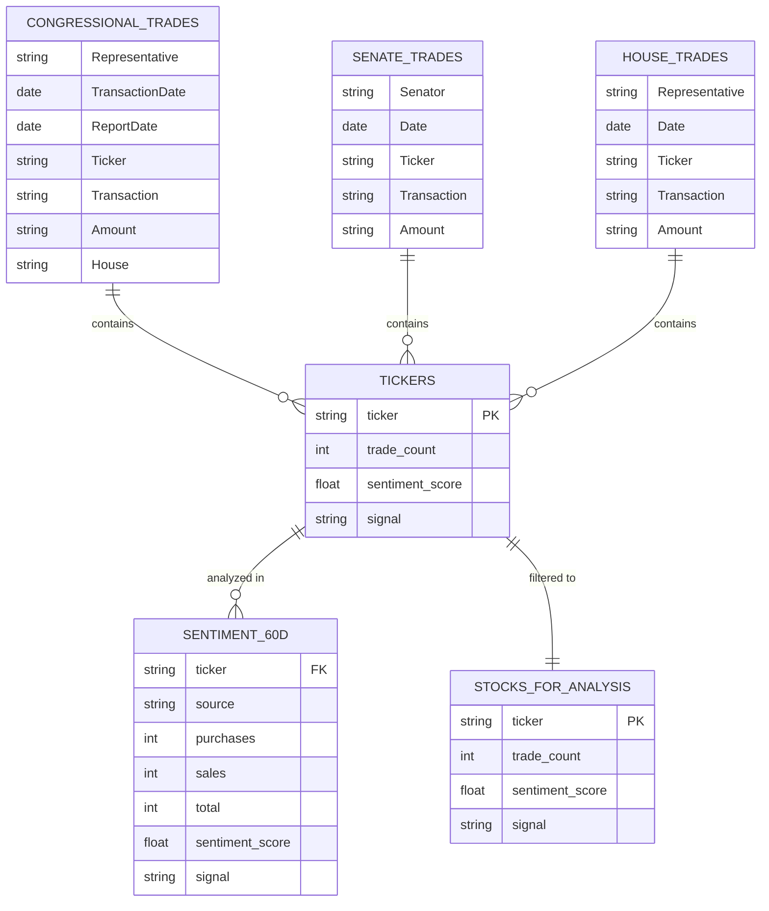
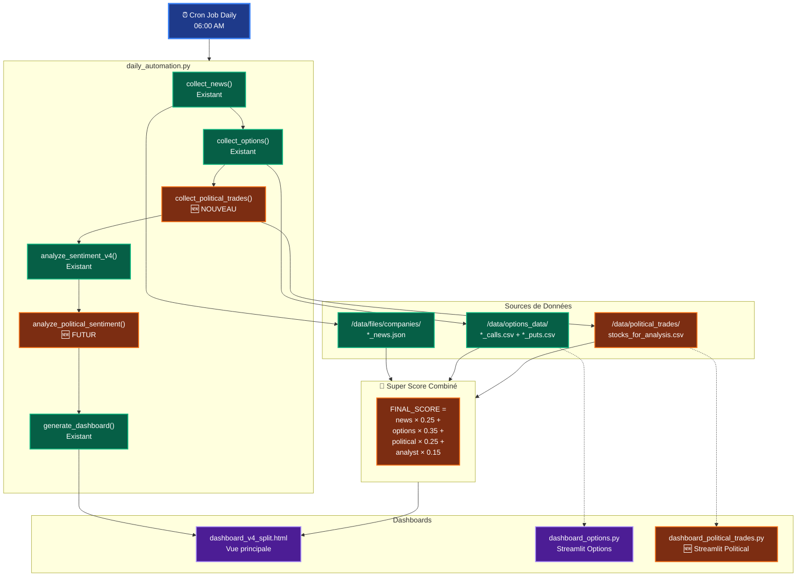
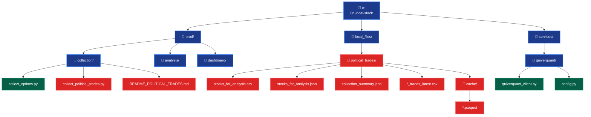
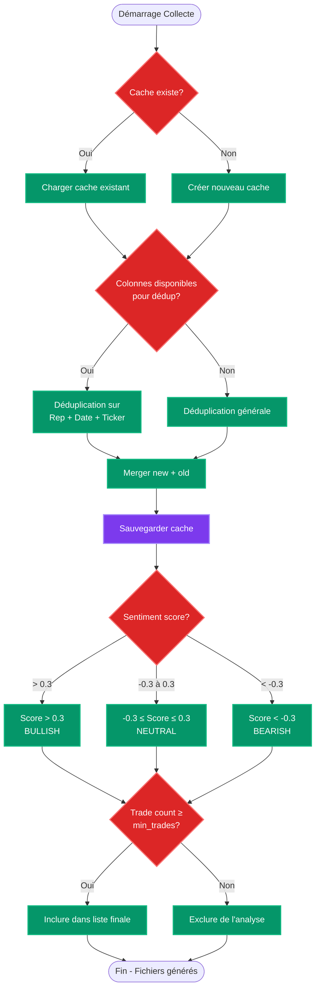

## Flux Détaillé par Fonction

## Structure des Données

## Pipeline d'Intégration (Future)

## Timeline d'Exécution Quotidienne

```mermaid
gantt
    title 📅 Automation Quotidienne avec Political Trades
    dateFormat HH:mm
    axisFormat %H:%M
    
    section Collection
    Collect News           :done, news, 06:00, 30m
    Collect Options        :done, opts, 06:30, 30m
    Collect Political Trades :crit, new, 07:00, 30m
    
    section Analyse
    Analyze Sentiment V4   :done, sent, 07:30, 30m
    Analyze Political Sentiment :crit, polsent, 08:00, 30m
    
    section Generation
    Generate Dashboard     :done, dash, 08:30, 30m
    
    section Ready
    Dashboard Available    :milestone, ready, 09:00, 0m
```

## Architecture Fichiers

## Décisions et Traitements

---

**Créé:** 2 Janvier 2026  
**Version:** 1.0  
**Documentation:** Flux complet du système Political Trades
